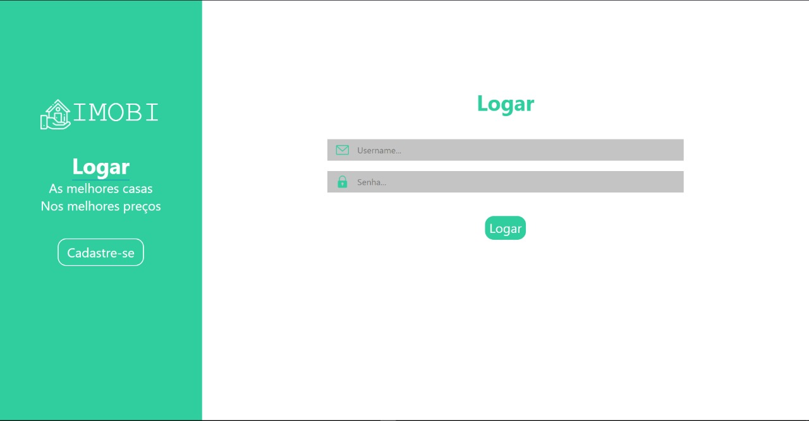
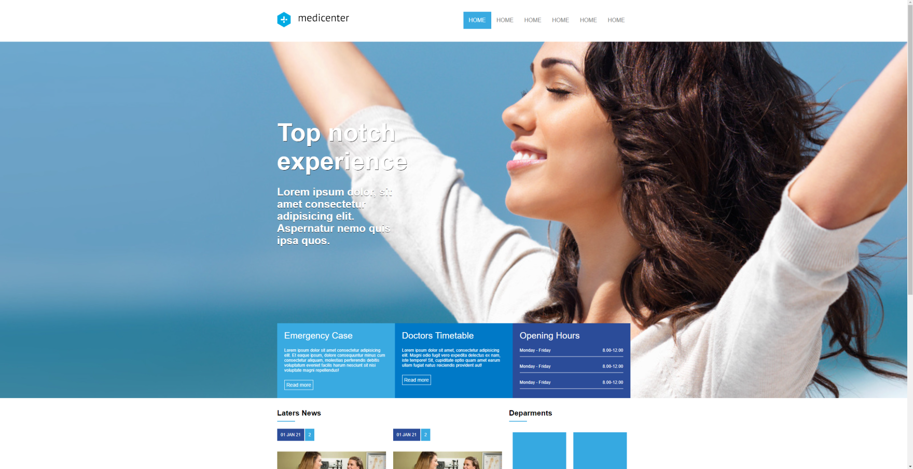
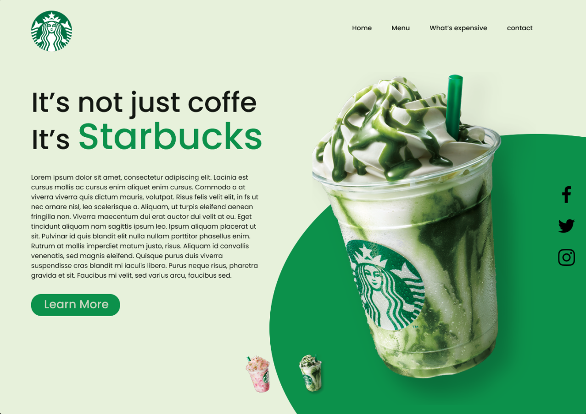
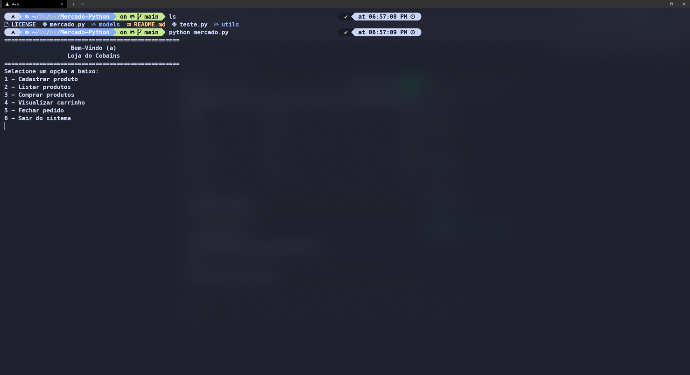

# Completed Project

## IMOBI

### Desc: Imobi is a website of real estate

#### Technologies: HTML5, CSS3, Python

#### Frameworks: Django

# MediCenter

## Desc: MediCenter e um Website of health clinics

### Technologies: HTML5, CSS3

#### Framework: No Framework

# Landing Page StartBucks

## Desc: Landing Page StartBucks

### Technologies: HTML5, CSS3, Javascript

#### Framework: No Framework

# Mercado.py

## Desc: Supermarket Simulator

### Technologies: Python, POO

#### Framework: No Framework

# Website Canil-node

## Desc: Kennel Website

### Technologies: Mustache, Node.js, Typescript, CSS3

#### Framework: Express

